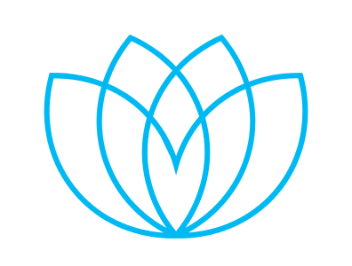

---

layout: col-sidebar
title: OWASP Cape Town
tags: cpt capetown southafrica africa
level: 0
region: Africa
meetup-group: OWASP-Cape-Town-Chapter-Meetup
country: South Africa
postal-code: 8000

---

## Welcome
OWASP Cape Town is a local South African chapter aimed at reaching and engaging the local developer and infosec community. 
OWASP Cape Town holds regular meetups as well as gets involved in local conferences and groups, such as, [BSIDES Cape Town](https://bsidescapetown.co.za). 

OWASP Cape Town is community driven and we always welcome local people to get involved in giving talks and share how they are doing their bit in securing the web. Please reach out if you would like to give a talk.

## Meetings

Everyone is welcome to join us at our chapter meetings. In person meetings are held at various locations and times as indicated in the event details on Meetup.

During government instituted lockdown our meetings have been held online using Zoom. These details are also in the event details on Meetup.  

### Join Our Events

Please join our meetup group if you would like to attend future events.
It is important to RSVP if you would like to attend as it helps us with planning the logistics.  
  - [OWASP Cape Town Chapter Meetup Group](http://www.meetup.com/OWASP-Cape-Town-Chapter-Meetup)

#### Upcoming  Events

 - [Upcoming events](https://www.meetup.com/OWASP-Cape-Town-Chapter-Meetup/events/)

#### Past Events

 - [Past events](https://www.meetup.com/OWASP-Cape-Town-Chapter-Meetup/events/past/)

### Sponsors

The following is the list of organisations who have generously provided us with space for OWASP Cape Town chapter meetings:

<table cellpadding="10" cellspacing="0" border="0">
<tr>
<td>  </td>

<td>  </td>

<td>  </td>
</tr>
</table>

### Slides

- Slides from 1st Official OWASP Cape Town Meeting: [1st Meeting Slides](/www-pdf-archive/Owasp-meeting1-17jun2015.pdf)

- Slides from 2nd Meeting [Intro To Enumeration](https://www.owasp.org/images/6/6e/Intro_To_Enumeration_FINAL_MAIL_OUT.odp)

- Slides Intro To Metasploit [Intro To Metasploit](https://www.owasp.org/index.php/File:Intro_To_Metasploit_FINAL.odp)

- Slides from PCI DSS Talk [PCI DSS](https://docs.google.com/presentation/d/1spHkDjvLA4apqKmIGrKRfNB1cMHWB8nzwjW_A3QzVTs)

### Public particpation on the South African 'Cybercrimes and Cybersecurity Bill (B6–2017)' 
During the public participation phase of the South African law-making process, OWASP Cape Town collected and provided many comments on the original 'Cybercrimes and Cybersecurity Bill (B6-2017)'. After a lengthy process the cybersecurity provisions, relating to intelligence services, were removed and the bill was renamed the Cybercrimes Bill.

#### Youtube Channel
Not all meetings are recorded and uploaded but those that are are available on our [OWASP Cape Town](https://www.youtube.com/channel/UC514UtotMbbNAPqP6aeNpXA) Youtube channel.

## Local Infosec Community

### Conferences

  - [BSIDES Cape Town](http://www.bsidescapetown.co.za)
  - [0xcon](https://0xcon.co.za)
 
### Community Meetups

  - [0xC0FFEE Monthly Hacker Meetup](https://twitter.com/0xC0FFEE_CPT)

## OWASP Participation

The Open Web Application Security Project (OWASP) is a nonprofit foundation that works to improve the security of software. All of our projects, tools, documents, forums, and chapters are free and open to anyone interested in improving application security. 

Chapters are led by local leaders in accordance with the [Chapter Leader Handbook](/www-policy/rules-of-procedure/chapter-handbook). 
Financial contributions should only be made online using the authorized online donation button. 
To be a SPEAKER at ANY OWASP Chapter in the world simply review the [speaker agreement](/www-policy/speaker-agreement) and then contact the local chapter leader with details of what OWASP Project, independent research, or related software security topic you would like to present.

Everyone is welcome and encouraged to participate in our [Projects](/projects), [Local Chapters](/chapters), [Events](/events), [Online Groups](https://groups.google.com/a/owasp.com/){:target='_blank'}, and [Community Slack Channel](https://owasp.slack.com/){:target='_blank'}. We especially encourage diversity in all our initiatives. OWASP is a fantastic place to learn about application security, to network, and even to build your reputation as an expert. We also encourage you to be [become a member](/membership) or consider a [donation](/donate) to support our ongoing work.

[Category:OWASP Chapter](Category:OWASP_Chapter )
[Category:Africa](Category:Africa )
